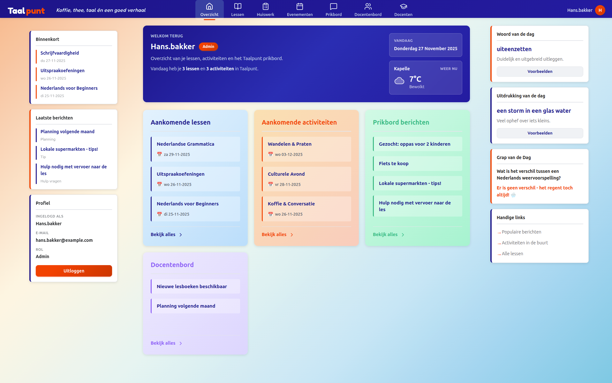
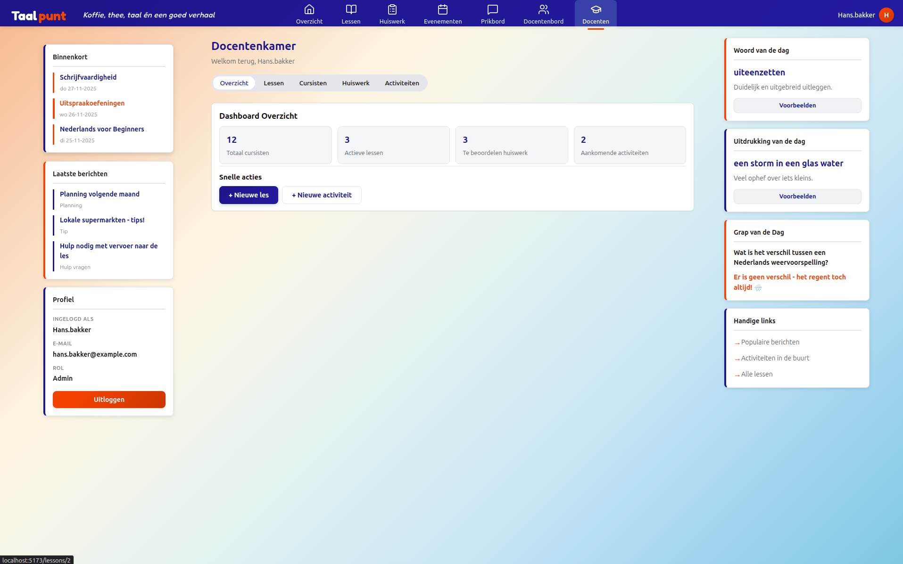
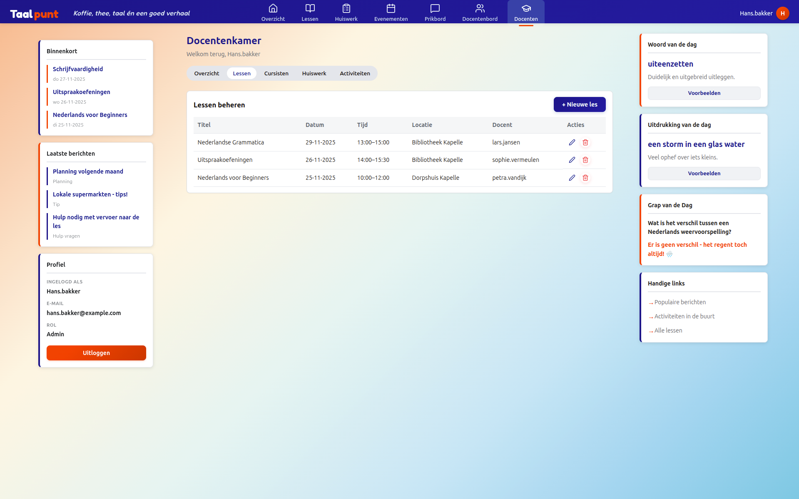

# Taalpunt - Nederlandse Taal Leerplatform


##  Inhoudsopgave

1. [Introductie](#introductie)
2. [Screenshots](#screenshots)
3. [Functionaliteiten](#functionaliteiten)
4. [Tech Stack](#tech-stack)
5. [Installatie](#installatie)
6. [Configuratie](#configuratie)
7. [Gebruik](#gebruik)
8. [Test Accounts](#test-accounts)
9. [Project Structuur](#project-structuur)
10. [API Endpoints](#api-endpoints)
11. [Scripts](#scripts)

##  Introductie

Taalpunt is een webapplicatie die Nederlandse taaldocenten en nieuwkomers verbindt met de lokale gemeenschap in Kapelle. Het platform biedt gestructureerd taalonderwijs, evenementenbeheer, en een gemeenschapsmededelingenbord.

### Belangrijkste Functionaliteiten

- 🔐 **Authenticatie & Autorisatie**: JWT-gebaseerde authenticatie met rol-gebaseerde toegang
- 📚 **Lesbeheer**: Docenten kunnen lessen aanmaken, beheren en huiswerk toewijzen
- 📅 **Evenementen**: Overzicht van lessen en gemeenschapsevenementen
- 💬 **Community Board**: Mededelingenbord voor tips, vragen en hulpaanbod
- 👩‍🏫 **Docentenkamer**: Privé ruimte voor docenten om intern te overleggen
- 📝 **Huiswerksysteem**: Compleet systeem voor huiswerk toewijzen, inleveren en beoordelen
- 🎨 **Moderne UI/UX**: Glassmorphism sidebar, responsive design, donkere modus ondersteuning

##  Screenshots


*Dashboard met overzicht van lessen, evenementen en berichten voor docenten*


*Dashboard met overzicht van lessen, evenementen en berichten*


*Docenetenkamer, docenten lesbeheer*


##  Tech Stack

### Frontend
- **React** 19.1.1 - UI Framework
- **React Router DOM** 7.9.6 - Client-side routing
- **React Hook Form** 7.66.0 - Form management en validatie
- **Axios** 1.13.2 - HTTP client
- **JWT Decode** 4.0.0 - JWT token parsing
- **Lucide React** - Icon library
- **Vite** 7.1.7 - Build tool

### Backend
- **NOVI Dynamic API** - REST API voor authenticatie en data management
- **JWT Authentication** - Secure token-based authentication

## 💻 Installatie

### Vereisten
- Node.js 18.0.0 of hoger
- npm 9.0.0 of hoger
- Git

### Stappen

1. **Clone de repository**
```bash
git clone https://github.com/fahedoudeh/taalpunt-react-app.git
cd taalpunt-react-app
```

2. **Installeer dependencies**
```bash
npm install
```

3. **Configureer environment variabelen**
```bash
# Kopieer het voorbeeld .env bestand
cp .env.example .env

# De .env file bevat al de juiste waardes:
# VITE_API_URL=
# VITE_NOVI_PROJECT_ID=
```

4. **Start de development server**
```bash
npm run dev
```

De applicatie draait nu op `http://localhost:5173`

##  Configuratie

### Environment Variabelen

| Variabele | Beschrijving | Standaard Waarde |
|-----------|--------------|------------------|
| `VITE_API_URL` | NOVI Backend API URL | https://novi-backend-api-wgsgz.ondigitalocean.app/api |
| `VITE_NOVI_PROJECT_ID` | NOVI Project ID voor API authenticatie | cc3fe423-f322-495b-95d9-0579d147a403 |

### NOVI API Configuratie

Het project gebruikt de NOVI Dynamic API. De configuratie bestanden zijn:
- `src/data/taalpunt-database-config.json` - Database structuur


##  Gebruik

### Voor Cursisten

1. **Registreren**: Maak een account aan met rol "Cursist"
2. **Dashboard**: Bekijk aankomende lessen en evenementen
3. **Lessen**: Bekijk lesdetails en lever huiswerk in
4. **Community Board**: Plaats berichten, stel vragen, bied hulp aan
5. **Evenementen**: Bekijk en meld je aan voor evenementen

### Voor Docenten

Alle cursist functionaliteiten plus:
1. **Docentenkamer**: Toegang tot privé docenten ruimte
2. **Lessen beheren**: Maak, bewerk en verwijder lessen
3. **Huiswerk**: Wijs huiswerk toe en beoordeel inleveringen
4. **Activiteiten**: Organiseer gemeenschapsactiviteiten
5. **Moderatie**: Beheer berichten op het community board

## 🧪 Test Accounts

### Docent Account
- **Email**: sophie.vermeulen@example.com
- **Wachtwoord**: Welkom123!

### Cursist Account  
- **Email**: maria.santos@example.com
- **Wachtwoord**: Welkom123!

### Cursist Account  
- **Email**: hans.bakker@example.com
- **Wachtwoord**: Admin456!


##  Project Structuur

```
src/
├── assets/          # Statische bestanden (images, icons)
├── components/      # Herbruikbare React componenten
│   ├── activity/    # Activiteit gerelateerde componenten
│   ├── board/       # Community board componenten
│   ├── dashboard/   # Dashboard componenten
│   ├── homework/    # Huiswerk componenten
│   ├── layout/      # Layout componenten (Navbar, Sidebar)
│   ├── lesson/      # Les componenten
│   ├── social/      # Sociale interactie componenten
│   └── ui/          # UI componenten (Button, Modal, etc.)
├── contexts/        # React Context providers
│   └── AuthContext.jsx
├── data/           # Statische data en configuratie
├── helpers/        # Utility functies
├── pages/          # Pagina componenten
├── routes/         # Route guards en configuratie
├── services/       # API service layer
└── styles/         # Globale styles en variabelen
```

## API Endpoints

### Authenticatie
- `POST /login` - Inloggen
- `POST /users` - Registreren

### Lessen
- `GET /lessons` - Alle lessen ophalen
- `GET /lessons/:id` - Specifieke les ophalen
- `POST /lessons` - Nieuwe les aanmaken (docent)
- `PUT /lessons/:id` - Les bijwerken (docent)
- `DELETE /lessons/:id` - Les verwijderen (docent)

### Berichten
- `GET /messages` - Alle berichten ophalen
- `POST /messages` - Nieuw bericht plaatsen
- `PUT /messages/:id` - Bericht bijwerken
- `DELETE /messages/:id` - Bericht verwijderen

### Evenementen
- `GET /events` - Alle evenementen ophalen
- `POST /events` - Nieuw evenement aanmaken
- `PUT /events/:id` - Evenement bijwerken
- `DELETE /events/:id` - Evenement verwijderen

### Huiswerk
- `GET /homework` - Huiswerk ophalen
- `POST /homework` - Huiswerk aanmaken (docent)
- `GET /submissions` - Inleveringen ophalen
- `POST /submissions` - Huiswerk inleveren (cursist)
- `PUT /submissions/:id` - Beoordeling geven (docent)

##  Scripts

```bash
# Development server starten
npm run dev

# Production build maken
npm run build

# Preview production build
npm run preview

# Linting
npm run lint

# Format code
npm run format
```

##  Contributing

1. Fork het project
2. Maak een feature branch (`git checkout -b feature/AmazingFeature`)
3. Commit je wijzigingen (`git commit -m 'feat: Add some AmazingFeature'`)
4. Push naar de branch (`git push origin feature/AmazingFeature`)
5. Open een Pull Request

### Commit Conventies

We gebruiken [Conventional Commits](https://www.conventionalcommits.org/):
- `feat:` Nieuwe feature
- `fix:` Bug fix
- `docs:` Documentatie
- `style:` Formatting, geen code wijzigingen
- `refactor:` Code refactoring
- `test:` Tests toevoegen
- `chore:` Maintenance

##  Licentie

Dit project is ontwikkeld als eindopdracht voor de NOVI Hogeschool Frontend leerlijn.

## 👤 Auteur

**Fahd Mohammad**

- Opleiding: Webdeveloper Bootcamp
- GitHub: [@fahedoudeh](https://github.com/fahedoudeh)

## 🙏 Acknowledgments

- NOVI Hogeschool voor de opleiding en begeleiding
- De Kapelle gemeenschap voor de inspiratie
- Alle open source contributors van de gebruikte libraries

---

*Ontwikkeld met ❤️ voor de Nederlandse taalleerlingen en -docenten in Kapelle*